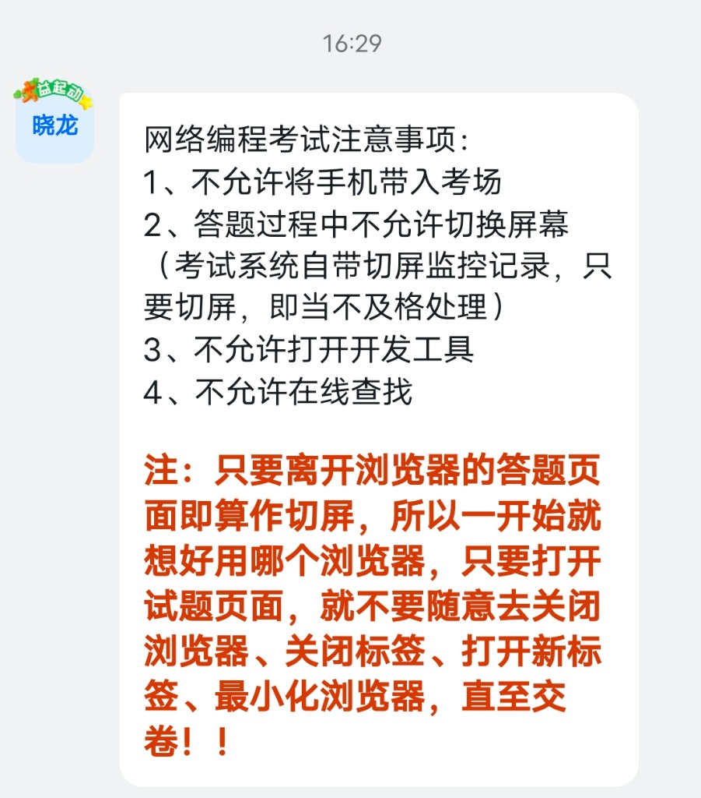

# 此次考试事项说明

## 考试形式
- **考试地点**：机房
- **考试方式**：上机测试

---

## ⚠️ 网络编程考试注意事项

### 禁止事项

1. **不允许将手机带入考场**
2. **答题过程中不允许切换屏幕**
   - 考试系统自带切屏监控记录
   - 只要切屏，即当不及格处理
3. **不允许打开开发工具**
4. **不允许在线查找**

---

### 🔴 特别注意

> **只要离开浏览器的答题页面即算作切屏！**
> 
> 所以一开始就想好用哪个浏览器，只要打开试题页面，就不要随意去：
> - ❌ 关闭浏览器
> - ❌ 关闭标签
> - ❌ 打开新标签
> - ❌ 最小化浏览器
> 
> **直至交卷！！**
