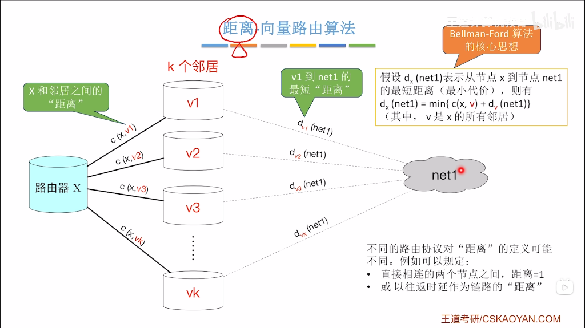

# 第5章 路由协议

## 核心知识点

---

### 1. 路由算法分类

#### 按使用范围分类

| 类型 | 全称 | 适用范围 | 代表协议 |
|------|------|----------|----------|
| **IGP** | Interior Gateway Protocol（内部网关协议） | 自治系统（AS）**内部** | RIP、OSPF、IS-IS |
| **EGP** | Exterior Gateway Protocol（外部网关协议） | 自治系统（AS）**之间** | BGP |

#### 按配置方式分类

| 类型 | 特点 | 优点 | 缺点 |
|------|------|------|------|
| **静态路由** | 管理员手动配置，路由表固定不变 | 安全性高、不消耗带宽、无需路由器计算 | 不能自动适应网络拓扑变化，管理负担重 |
| **动态路由** | 路由器之间交换路由信息，自动更新路由表 | 自动适应网络变化，适合大型网络 | 消耗网络带宽和路由器资源 |

#### 按路由算法分类

| 类型 | 代表协议 | 工作原理 | 特点 |
|------|----------|----------|------|
| **距离向量算法** | RIP | 每个路由器只知道相邻路由器的信息，通过邻居传递路由信息 | 简单，但收敛慢，不适合大型网络 |
| **链路状态算法** | OSPF | 每个路由器了解全网拓扑，使用 **Dijkstra（SPF）算法**计算最短路径 | 收敛快，适合大型网络 |
| **路径向量算法** | BGP | 在路由信息中携带完整 AS 路径，防止路由环路 | 适合 AS 间路由，可基于策略选路 |

---

### 2. RIP 协议的特点、工作原理、报文格式

#### RIP 协议特点

- **应用层协议**：基于 UDP，端口号 520
- **IGP 协议**：用于自治系统（AS）内部
- **距离向量协议**：使用**跳数（Hop Count）**作为度量值
- **最大跳数限制**：15 跳，16 跳表示不可达
- **定时更新**：每 **30 秒**广播一次完整路由表
- **路由失效时间**：**180 秒**未收到邻居更新则认为路由失效
- **简单易用**：配置简单，适合小型网络
- ✅ **优点**：好消息传得快（新路由快速传播）
- ❌ **缺点**：坏消息传得慢（慢收敛问题）

#### RIP 计时器体系

| 计时器 | 时间 | 作用 |
|--------|------|------|
| **更新计时器（Update Timer）** | 30s | 周期性向邻居发送完整路由表 |
| **失效计时器（Invalid Timer）** | 180s（6×30s） | 超时未收到更新，标记路由为不可达（跳数 16） |
| **刷新计时器（Flush Timer）** | 240s | 失效路由在此时间后从路由表中删除 |
| **抑制计时器（Hold-down Timer）** | 60s/180s | 路由失效后，暂时不接受关于该路由的新信息 |

#### 工作原理（距离向量算法 / Bellman-Ford 算法）

1. **初始化**：路由器启动时，只知道直连网络（距离为 1）
2. **路由通告**：每 30 秒向邻居广播完整路由表
3. **路由更新**：收到邻居路由表后，比较并更新本地路由表
   - 若目标网络不存在，添加新路由（跳数 +1）
   - 若新路径跳数更少，更新为新路径
   - 若来自同一下一跳的更新，无条件接受
   - 否则丢弃

**距离向量算法核心思想**：



- 路由器 X 到目标网络 net1 的最短距离：**d<sub>x</sub>(net1) = min{ c(x, v) + d<sub>v</sub>(net1) }**
- 其中 **c(x, v)** 是 X 到邻居 v 的距离，**d<sub>v</sub>(net1)** 是邻居 v 到 net1 的距离

#### 路由表项示例

**邻居发送的路由表**（RIP 通告内容）：

| 目的网络 | 跳数（Metric） |
|----------|----------------|
| 10.1.0.0/24 | 1 |
| 10.2.0.0/24 | 2 |
| 192.168.1.0/24 | 3 |

**本地路由表**（收到邻居通告后更新）：

| 目的网络 | 下一跳 | 跳数 | 出接口 |
|----------|--------|------|--------|
| 10.1.0.0/24 | 192.168.0.2 | 2 | eth0 |
| 10.2.0.0/24 | 192.168.0.2 | 3 | eth0 |
| 192.168.1.0/24 | 192.168.0.2 | 4 | eth0 |
| 192.168.0.0/24 | 直连 | 1 | eth0 |

> **注意**：收到邻居路由后，跳数需 **+1**（因为要经过邻居这一跳）

#### RIPv2 报文格式

```
 0                   1                   2                   3
 0 1 2 3 4 5 6 7 8 9 0 1 2 3 4 5 6 7 8 9 0 1 2 3 4 5 6 7 8 9 0 1
+-+-+-+-+-+-+-+-+-+-+-+-+-+-+-+-+-+-+-+-+-+-+-+-+-+-+-+-+-+-+-+-+
|  Command (8)  |  Version (8)  |         Must Be Zero          |
+-+-+-+-+-+-+-+-+-+-+-+-+-+-+-+-+-+-+-+-+-+-+-+-+-+-+-+-+-+-+-+-+
|         Address Family        |         Route Tag             |
+-+-+-+-+-+-+-+-+-+-+-+-+-+-+-+-+-+-+-+-+-+-+-+-+-+-+-+-+-+-+-+-+
|                         IP Address                            |
+-+-+-+-+-+-+-+-+-+-+-+-+-+-+-+-+-+-+-+-+-+-+-+-+-+-+-+-+-+-+-+-+
|                         Subnet Mask                           |
+-+-+-+-+-+-+-+-+-+-+-+-+-+-+-+-+-+-+-+-+-+-+-+-+-+-+-+-+-+-+-+-+
|                         Next Hop                              |
+-+-+-+-+-+-+-+-+-+-+-+-+-+-+-+-+-+-+-+-+-+-+-+-+-+-+-+-+-+-+-+-+
|                         Metric (跳数)                          |
+-+-+-+-+-+-+-+-+-+-+-+-+-+-+-+-+-+-+-+-+-+-+-+-+-+-+-+-+-+-+-+-+
```

- **Command**：1 = Request，2 = Response
- **Version**：1 = RIPv1，2 = RIPv2
- **Metric**：到目标网络的跳数（1-16）

---

### 3. RIP 协议的慢收敛问题及改进措施

#### 慢收敛问题（Count to Infinity）

当网络拓扑变化时（如链路故障），RIP 需要较长时间才能收敛到稳定状态。

**示例**：假设 A-B-C 线性连接，C 不可达时：
- B 将 C 的距离设为 16（不可达）
- 但 A 仍认为可通过 B 到达 C（距离 2）
- A 通告给 B，B 误认为可通过 A 到达 C（距离 3）
- 如此往复，跳数不断增加，直到达到 16

#### 改进措施

| 措施 | 原理 | 效果 |
|------|------|------|
| **水平分割（Split Horizon）** | 不向路由信息的来源方向发送该路由 | 防止路由环路形成 |
| **毒性逆转（Poison Reverse）** | 向来源方向发送该路由，但距离设为 16（不可达） | 加速收敛，明确告知不可达 |
| **触发更新（Triggered Update）** | 拓扑变化时立即发送更新，不等待 30 秒定时器 | 加快收敛速度 |
| **抑制计时器（Hold-down Timer）** | 路由失效后一段时间内不接受新路由信息 | 防止接受错误的恢复信息 |

---

### 4. RIPv1 与 RIPv2 的区别

| 特性 | RIPv1 | RIPv2 |
|------|-------|-------|
| **是否支持 VLSM/CIDR** | ❌ 不支持（有类路由） | ✅ 支持（无类路由） |
| **子网掩码** | ❌ 不携带 | ✅ 携带子网掩码字段 |
| **认证** | ❌ 不支持 | ✅ 支持明文和 MD5 认证 |
| **传输方式** | 广播（255.255.255.255） | **组播**（224.0.0.9） |
| **下一跳字段** | ❌ 不携带 | ✅ 携带 Next Hop 字段 |
| **路由标记（Route Tag）** | ❌ 不支持 | ✅ 支持（用于外部路由标识） |

> **关键区别**：RIPv2 通过携带子网掩码支持 VLSM（可变长子网掩码），是无类路由协议。

---

### 5. OSPF 协议的特点、工作原理

#### OSPF 协议特点

- **链路状态协议**：每个路由器维护全网拓扑数据库（LSDB）
- **网络层协议**：直接封装在 IP 中，协议号 89
- **无跳数限制**：使用**代价（Cost）**作为度量值（通常基于带宽）
- **收敛速度快**：使用 SPF（Dijkstra）算法计算最短路径
- **支持 VLSM/CIDR**：无类路由协议
- **支持区域划分**：减少 LSA 泛洪，适合大型网络
- **支持认证**：明文和 MD5 认证
- **支持等价负载均衡**：多条等代价路径可同时使用

#### 工作原理

1. **建立邻居关系**
   - 发送 Hello 报文（组播 224.0.0.5）
   - 发现邻居，建立邻接关系

2. **同步链路状态数据库（LSDB）**
   - 交换 Database Description（DBD）报文
   - 请求缺失的 LSA（Link State Request）
   - 接收 LSA 更新（Link State Update）
   - 确认收到（Link State Acknowledgment）

3. **计算最短路径**
   - 使用 **SPF（Dijkstra）算法**
   - 以自己为根，计算到所有目的网络的最短路径树
   - 生成路由表

4. **维护路由**
   - 拓扑变化时，触发增量 LSA 更新
   - 定期刷新 LSA（每 30 分钟）

---

### 6. OSPF 的区域划分及路由器类型

#### 区域划分

| 区域类型 | Area ID | 特点 |
|----------|---------|------|
| **主干区域（Backbone Area）** | Area 0 | 所有非主干区域必须直接或通过虚链路连接到 Area 0 |
| **非主干区域（Non-backbone Area）** | Area 1, 2, ... | 连接到 Area 0，减少 LSA 泛洪范围 |
| **末梢区域（Stub Area）** | - | 不接收外部 LSA，使用默认路由 |
| **完全末梢区域（Totally Stubby Area）** | - | 不接收外部和区域间 LSA |
| **NSSA（Not-So-Stubby Area）** | - | 允许引入少量外部路由 |

#### 路由器类型

| 类型 | 英文 | 位置 | 功能 |
|------|------|------|------|
| **内部路由器（IR）** | Internal Router | 所有接口在同一区域 | 只维护本区域 LSDB |
| **区域边界路由器（ABR）** | Area Border Router | 连接多个区域，至少一个在 Area 0 | 汇总区域间路由，维护多个 LSDB |
| **骨干路由器（BR）** | Backbone Router | 至少一个接口在 Area 0 | 参与主干区域路由计算 |
| **自治系统边界路由器（ASBR）** | AS Boundary Router | AS 边界 | 将外部路由（如 RIP、静态）引入 OSPF |

---

### 7. OSPF 协议的五种报文类型、DR、BDR

#### 五种报文类型

| 类型 | 名称 | 功能 |
|------|------|------|
| **Type 1** | Hello | 发现邻居，建立/维护邻接关系，选举 DR/BDR |
| **Type 2** | Database Description (DBD) | 描述本地 LSDB 摘要，用于数据库同步 |
| **Type 3** | Link State Request (LSR) | 请求邻居发送特定 LSA |
| **Type 4** | Link State Update (LSU) | 发送 LSA 更新 |
| **Type 5** | Link State Acknowledgment (LSAck) | 确认收到 LSA |

#### DR 和 BDR（指定路由器与备份指定路由器）

**适用场景**：多路访问网络（如以太网），减少邻接关系数量

**作用**：
- 在多路访问网络中，所有路由器只与 DR 和 BDR 建立邻接关系
- 减少 LSA 泛洪次数，降低网络开销

**选举规则**：
1. 比较 **OSPF 优先级**（Priority），值大者优先
2. 优先级相同时，比较 **Router ID**，值大者优先
3. 优先级为 0 的路由器不参与选举
4. **非抢占**：DR 确定后，新加入的更高优先级路由器不会抢占

**组播地址**：
- **224.0.0.5**：所有 OSPF 路由器（AllSPFRouters）
- **224.0.0.6**：DR 和 BDR（AllDRouters）

---

### 8. BGP 协议的特点、作用、工作原理

#### BGP 协议特点

- **路径向量协议**：携带完整 AS 路径，防止环路
- **应用层协议**：基于 **TCP**，端口号 **179**
- **EGP 协议**：用于自治系统（AS）之间的路由
- **增量更新**：只发送变化的路由信息，而非全表
- **支持 CIDR**：无类路由协议
- **支持策略路由**：可根据多种属性选择路径

#### BGP 的作用

- **AS 间路由选择**：连接不同自治系统，是互联网的核心路由协议
- **传递可达性信息**：告知其他 AS 哪些网络可以通过本 AS 到达
- **防止路由环路**：通过 AS_PATH 属性检测环路
- **策略控制**：支持复杂的路由策略（选路、过滤、聚合）

#### 工作原理

1. **建立 TCP 连接**
   - BGP 邻居之间建立 TCP 连接（端口 179）
   - 手动配置邻居关系

2. **建立 BGP 会话**
   - 交换 OPEN 消息，协商参数
   - 确认后进入 Established 状态

3. **交换路由信息**
   - 首次交换完整 BGP 路由表
   - 之后只发送**增量更新**（UPDATE 消息）

4. **路由决策**
   - 根据 BGP 属性（AS_PATH、LOCAL_PREF、MED 等）选择最优路径

5. **维护会话**
   - 定期发送 KEEPALIVE 消息（默认 60 秒）
   - 检测邻居存活状态

#### iBGP 与 eBGP

| 类型 | 全称 | 邻居位置 | 特点 |
|------|------|----------|------|
| **iBGP** | Internal BGP | 同一 AS 内 | 需要全互连或使用路由反射器 |
| **eBGP** | External BGP | 不同 AS 之间 | 通常直连，AS_PATH +1 |

---

### 9. BGP 协议的四种报文类型及状态机

#### 四种报文类型

| 类型 | 名称 | 功能 |
|------|------|------|
| **OPEN** | 打开报文 | 建立 BGP 连接，协商参数（AS 号、Hold Time、Router ID） |
| **UPDATE** | 更新报文 | 通告新路由、撤销失效路由，携带路径属性 |
| **KEEPALIVE** | 保活报文 | 维持邻居关系，周期性发送（默认 60 秒） |
| **NOTIFICATION** | 通知报文 | 报告错误，关闭 BGP 连接 |

#### BGP 状态机（六种状态）

```
┌─────────────────────────────────────────────────────────────────┐
│                          BGP 状态机                              │
├─────────────────────────────────────────────────────────────────┤
│  Idle ──► Connect ──► OpenSent ──► OpenConfirm ──► Established  │
│    │           │                                                │
│    │           └──► Active ──────────────────────────┘          │
│    └────────────────────────────────────────────────────────────│
└─────────────────────────────────────────────────────────────────┘
```

| 状态 | 描述 |
|------|------|
| **Idle** | 初始状态，拒绝所有连接请求 |
| **Connect** | 正在尝试建立 TCP 连接 |
| **Active** | TCP 连接失败，尝试重新连接 |
| **OpenSent** | TCP 连接成功，已发送 OPEN 消息，等待对方 OPEN |
| **OpenConfirm** | 收到对方 OPEN 消息，等待 KEEPALIVE 确认 |
| **Established** | 邻居建立成功，可以交换 UPDATE 消息 |

#### BGP 路径属性（常见）

| 属性 | 类型 | 描述 |
|------|------|------|
| **AS_PATH** | 公认必遵 | 经过的 AS 列表，用于防环和选路 |
| **NEXT_HOP** | 公认必遵 | 下一跳 IP 地址 |
| **ORIGIN** | 公认必遵 | 路由来源（IGP/EGP/Incomplete） |
| **LOCAL_PREF** | 公认自决 | 本地优先级，iBGP 内选路，值越大越优先 |
| **MED** | 可选非过渡 | 多出口鉴别符，影响入站流量路径 |

---

## 重点对比总结

### RIP vs OSPF vs BGP

| 特性 | RIP | OSPF | BGP |
|------|-----|------|-----|
| **类型** | IGP（距离向量） | IGP（链路状态） | EGP（路径向量） |
| **传输协议** | UDP 520 | IP 89 | TCP 179 |
| **度量值** | 跳数（最大 15） | 代价（Cost） | 路径属性 |
| **收敛速度** | 慢 | 快 | 取决于策略 |
| **适用规模** | 小型网络 | 中大型网络 | AS 间 / 互联网 |
| **更新方式** | 定期全表（30s） | 触发增量 | 增量更新 |
| **支持 VLSM** | RIPv1 不支持 | 支持 | 支持 |

---

## 常见考点速记

1. **RIP 使用 UDP 端口 520，最大跳数 15**
2. **OSPF 协议号 89，组播地址 224.0.0.5 和 224.0.0.6**
3. **BGP 使用 TCP 端口 179，是唯一的 EGP 协议**
4. **水平分割解决 RIP 慢收敛问题**
5. **OSPF 五种报文：Hello、DBD、LSR、LSU、LSAck**
6. **BGP 四种报文：OPEN、UPDATE、KEEPALIVE、NOTIFICATION**
7. **DR 选举规则：优先级 → Router ID，非抢占**
8. **RIPv2 支持子网掩码、认证、组播**
